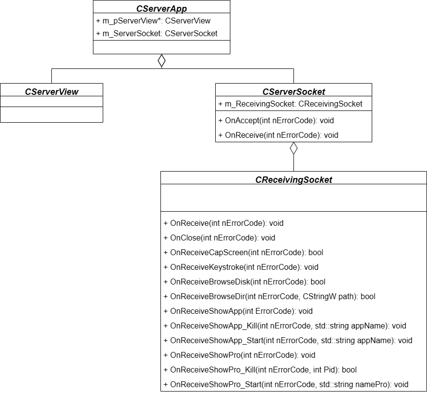

# Remote Controller with Socket
Project for Computer Network course in Semester 4, HCMUS.

The application allows users (using a client host) to remotely control a computer (server host) within the same LAN network. The application utilizes sockets and TCP protocol at the Transport layer and is programmed in the C++ language, using the MFC library. 

## Features
Here are the functions of the application:

- Connect to the server using the IP address and Port number.
- Show information about the processes currently running on the server.
- Show information about the applications currently running on the server.
- Capture the screen of the server machine.
- Capture key presses on the server machine.
- Browse the directory tree on the server machine.

## Usage
In order to run this application directly, users only need to download either of 2 files:
- Server/x64/Debug/Server.exe
- Client/x64/Debug/Client.exe

## Project Diagrams

| Client Diagram                                    | Server Diagram                                    |
|---------------------------------------------------|---------------------------------------------------|
|      |     |

The diagrams above illustrate the architecture of the client and server components, respectively.